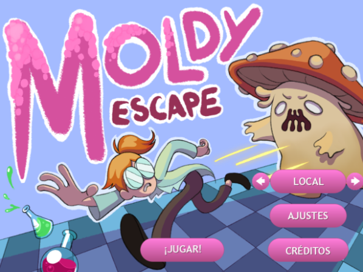
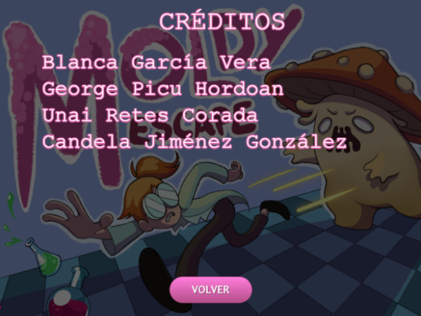
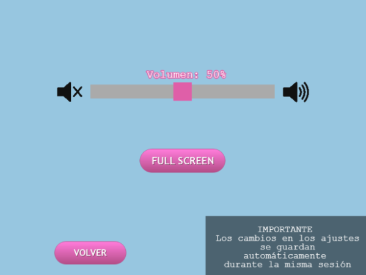
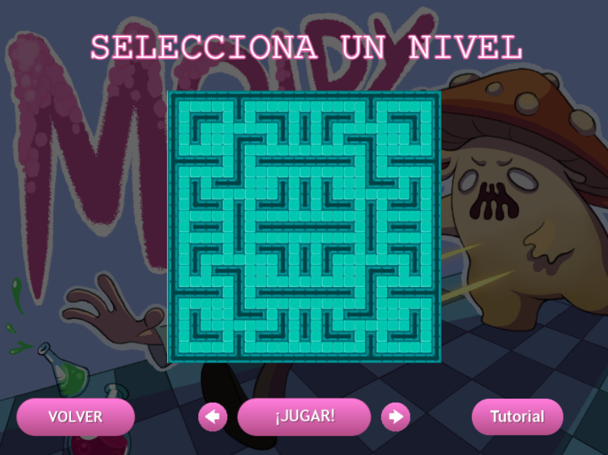
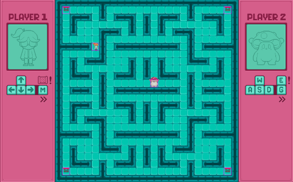
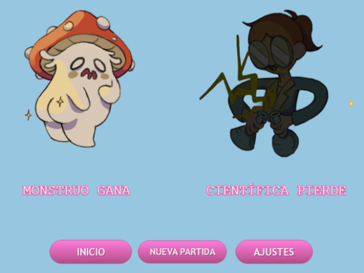

# MoldyEscape

**Descripción de la temática del juego**: Es un videojuego de persecución demtro de un laberinto con un ambiente de fantasía oscura o ciencia ficción dibujado en pixelart. 

**Integrantes**

  - George Picu Hordoan
    - Correo: g.picu.2018@alumnos.urjc.es
    - Github: picugeo27
  
  - Unai Retes Corada 
    - Correo: u.retes.2021@alumnos.urjc.es
    - Github: UCoRetz

  - Candela Jiménez González 
    - Correo: c.jimenezg.2022@alumnos.urjc.es
    - Github: thecorpsebutcher

  - Blanca García Vera 
    - Correo: b.garciav.2021@alumnos.urjc.es
    - Github: bgv102

    
# **GAME DESIGN DOCUMENT: MOLDY ESCAPE**

**Juegos en Red**
**URJC – GDDV 2024/2025**

**Versión 0.2**
 

## Introducción

Este es el documento de diseño del videojuego (GDD) de Moldy Escape. En él se especifican las características que tendrá junto con las decisiones tomadas sobre su diseño. Su función es facilitar a desarrollar el videojuego, así como presentarlo en detalle.

## Concepto del juego e idea inicial

   

El juego transcurre en un laberinto en el que se encontrarán los dos jugadores, que tienen dos roles distintos, el de presa y el de cazador.  La presa huye del cazador y tiene como objetivo neutralizarlo para escapar. Por otro lado, el cazador debe intentar atrapar a la presa e impedir su huida antes de que la presa llegue a su objetivo.

## Historia

La científica Rumpelstinski se ha despistado para ver que su último experimento, en el que trataba de traer a la vida una pequeña muestra de moho, acabó evolucionando de forma muy acelerada y creando una nueva forma de vida fúngica monstruosa.

El monstruo hambriento y la científica están atrapados en un laberíntico laboratorio. Rumpelstinski tendrá que neutralizar a la masa de moho antes de ser devorado por ella, y para conseguirlo deberá activar tres palancas que acabarán atrapando su desastrosa creación.

## Objetivo del juego

Al ser videojuego jugado por dos personas en una sola pantalla, hemos decidido hacer que el objetivo de los jugadores sea sencillo para no saturar la pantalla con demasiados estímulos y que los jugadores pierdan su objetivo.

En el juego existen dos roles, el de cazador y el de presa, que tienen objetivos distintos y excluyentes.

### Científica

El objetivo de la científica es escapar del laberinto, y para ello, tendrá que cumplir 3 objetivos para neutralizar al monstruo. Estos subobjetivos serán 4 palancas que aparecerán en el laberinto al inicio de cada partida, de los cuales solamente tendrá que activar 3, para evitar que la científica pueda estar esperando en un punto y que el otro jugador no pueda hacer nada para avanzar.

Una vez activadas las palancas, se soltará un gas que neutralizará al monstruo y el científico ganará la partida.

### Monstruo

Tras liberarse de su jaula, el monstruo quiere atrapar a la científica para vengarse de todo el sufrimiento que ha recibido por parte de ella. Para ello, tendrá que atraparla antes de que pueda escapar de su propio laboratorio.

El monstruo tendrá mayor velocidad de movimiento para poder atrapar a la presa más fácilmente.

## Género

Este juego entra dentro del género RPG \- laberinto, ya que puedes tomar el papel de uno de los personajes ficticios (científico o monstruo) para avanzar a través del laberinto cumpliendo con el objetivo correspondiente.

## Temática

La temática principal es de persecución, desarrollada en un ambiente de fantasía o ciencia ficción oscura. La presa tiene que cumplir su objetivo para acabar con la vida del monstruo, ya que pone en peligro su propia vida y la de muchos más. Mientras tanto el monstruo (cazador) deberá atrapar al científico para sobrevivir. 

## Plataforma

El juego estará disponible a través de la web. Para poder ejecutarlo se necesita como soporte un navegador.

Aun así, en una primera instancia no tendrá compatibilidad con dispositivos móviles o similares que no puedan manejar los controles base. Se plantea implementarlos en un futuro si cumple con las expectativas.

## Modelo de negocio

El modelo de negocio que se va a emplear para este juego es el conocido como PWYC (Pay What You Can), donde se deja al jugador pagar lo que considere.

De esta forma todos los jugadores que quieran pueden disfrutar del juego sin necesidad de pagar, pero si quieren pueden hacer alguna aportación o donación a través de plataformas como Patreon para impulsar el desarrollo del mismo.

Para incentivar las donaciones, se pretende ofrecer contenido estético como skins o efectos visuales especiales, que no afectarán al gameplay ni proporcionarán ventaja de ningún tipo, pero ofrecerán a los jugadores más opciones de personalización para que puedan mostrar su estilo.

## Clasificación

Según distintas clasificaciones el juego calificaría:

- **PEGI (Pan European Game Information) (Europa):** PEGI 12\.

- **ESRB (Entertainment Software Rating Board) (EE. UU.):** Teen.

- **CERO (Computer Entertainment Rating Organization) (Japón):** B.

## Audiencia y público objetivo

Moldy Escape es un videojuego destinado principalmente a un público joven, comprendido entre 12 y 35 años con gusto por la ciencia ficción y los juegos rápidos y dinámicos con objetivos claros.

### Propósito

Este juego tiene como propósito el ocio de los jugadores, además de fomentar la socialización junto con la competitividad sana.

### Interacción

El punto de vista del juego va a ser en tercera persona con cámara cenital, con una representación 2D, siguiendo un estilo pixel art.

El juego busca entretener y provocar tensión en los jugadores: uno de ellos, el que toma el papel de científico, debe huir de su propia creación activando mecanismos del laberinto antes de que le devore; y el monstruo debe perseguir al científico antes de que este logre escapar. Ese juego que se forma entre ambos, similar al pilla-pilla, genera tensión ya que ambos jugadores luchan por acabar con el otro. Asimismo, también busca realzar el espíritu competitivo de ambos jugadores, ya que al competir el uno contra el otro, siempre surgirá el deseo de demostrar quién es el mejor de los dos.

## Mecánicas del juego (cámara, controles)

   

### Jugabilidad

Ambos personajes se pueden desplazar por el laboratorio. Podrán interactuar con diferentes elementos del entorno, según sus respectivos roles, para conseguir su objetivo.

La pantalla del juego contiene la completitud del mapa por el que se podrán mover los dos jugadores, así como los diferentes elementos con los cuales pueden interactuar los jugadores, bien sean los objetivos o el laberinto en sí.

### Movimiento

Los dos jugadores tienen un movimiento similar, con pequeñas variaciones según su rol. Estas variaciones serán principalmente la velocidad, para que el cazador pueda atrapar a la presa y alguna habilidad propia.

Los personajes se pueden desplazar por el espacio del suelo en 4 direcciones, arriba, abajo, derecha e izquierda.

La científica se podrá mover con las teclas de flecha y el monstruo se puede mover con las teclas de WASD.

### Habilidades

Cada jugador dispondrá de una habilidad que podrá ir reutilizando a lo largo de la partida para facilitarle su tarea. Cada uno tendrá una habilidad personalizada que le ayude a conseguir su objetivo.

* La presa, a partir de la segunda fase, será la única que pueda pasar por las puertas del laberinto, mientras que el monstruo no puede, dificultando su navegación a través del laberinto y la captura de la científica. En esta fase se dispone de mapas sencillos, ninguno de ellos incluye puertas.
* El cazador por su parte podrá colocar varias trampas en el suelo que ralenticen unos segundos a la presa. Estas trampas serán invisibles para ambos jugadores, y solo se activarán cuando pase por encima la presa.

Este apartado se podrá ampliar según avance el desarrollo del videojuego.

   

### Diagrama de flujo

**Partida**

El siguiente diagrama representa de manera simplificada cómo funcionaría una partida de Moldy Escape.

Una vez empezada la partida, los jugadores se moverán para acercarse a sus objetivos. Las habilidades de las que disponen entran dentro del “movimiento del jugador”, porque se realizarían de manera simultánea.

Después se comprobará si alguno de los jugadores ha completado su objetivo, si es el caso uno de ellos habrá ganado y el otro habrá perdido. En caso contrario se volverá a la fase de movimiento.

**Pantallas**

El siguiente diagrama representa el flujo de pantallas del juego.  
Desde la pantalla de inicio se puede acceder a la pantalla de ajustes, a la de créditos, y a la pantalla de selección de niveles. Además, en una fase de desarrollo futura, desde aquí se podrá elegir entre un modo de juego local y uno en red.  
En la pantalla de selección de niveles, se puede acceder a una pantalla de tutorial donde se explican los controles y el funcionamiento de una partida, y desde la que se puede volver a la selección de personaje. Una vez elegido el laberinto, el jugador se dirige a la pantalla de juego.  
En la pantalla de juego, este continúa indefinidamente hasta que uno de los jugadores gana, en cuyo caso se accede a la pantalla de fin de partida, donde se puede ver quién es el ganador y quién es el perdedor. Desde esta pantalla de fin de partida, se puede volver a acceder a la pantalla de inicio, empezar una nueva partida o volver a cambiar los ajustes.

## Niveles

Los niveles de juego se tratan de laberintos por donde tendrán que avanzar los personajes cumpliendo con sus objetivos.

Se ha añadido la opción de seleccionar entre dos laberintos con diferente disposición de los elementos, con el fin de que no todas las partidas sean iguales. 

Estos mapas se han introducido para desafiar a los jugadores en entornos más complicados de navegar cómodamente debido a las pocas rectas y los muchos movimientos de los personajes.

## Arte del juego

El juego tiene un estilo artístico de píxel art con colores vivos y contrastados, pero con una estética un poco oscura.

### Personajes

**Científica**

   

**Fungo**

   

## Audio

En una primera instancia el videojuego tendrá diferentes sonidos según el momento actual o las interacciones que se realicen. A continuación, se muestran referencias de música de fondo o sonidos que se incluirán en el videojuego, junto con una lista de qué efectos de sonido se necesitarán.

- **Grusha's Ice Racing \- Pokémon Scarlet and Violet OST (Gamerip):** https://youtu.be/Feh\_GwpOMwQ?si=eovsdhbN\_pYD7tDM

- **Hurry Along \- Pokémon Scarlet and Violet OST (Gamerip):** https://www.youtube.com/watch?v=oPgLBD8OzDA\&list=PLxdQfrU9eTcP-Kju9otVdp8yi7jwsgDRl\&index=63

- **Captured a Flag Underground\! \- Pokémon Diamond & Pokémon Pearl (OST):** https://www.youtube.com/watch?v=NBhI7HYaF2w\&list=PLEiOTsktKIotkjt3fP45HP9yWrP\_s5\_iI\&index=98

- **Strange House \- Pokémon Black 2 & Pokémon White 2 (OST):** https://youtu.be/tuGLC3m6x-o?si=y63j76Q5Qr6waVpn

- **Help Me\! (Pokémon Omega Ruby & Alpha Sapphire OST):** https://youtu.be/MC9zEv85jp0?si=xImEFv7izjS-c0uL

- **H-Help Me\! \- Pokémon Ruby & Pokémon Sapphire (OST):** https://youtu.be/4tbW0YZJmkQ?si=bAyG4q3yYIOhoNI8

Los sonidos base serán:

* Música de pantalla de inicio.  
* Música durante la partida.  
* Sonido que produce la presa al alcanzar un subobjetivo.  
* Sonido del cazador al alcanzar a la presa.  
* Sonido de victoria para el ganador en la pantalla final.  
* Sonido de derrota para el perdedor en la pantalla final.  
* Sonido al utilizar una habilidad.  
* Sonido al iniciar la partida.

Los audios añadidos en la segunda fase de desarrollo del juego han sido descargados de páginas web como [Freesound](https://freesound.org/), todos con licencias Creative Commons 0\. Se han añadido sonidos para:

* **Pantalla de inicio, pantalla de créditos, pantalla de tutorial, pantalla de selección de personaje y menú de ajustes**: todas estas pantallas comparten la misma melodía de fondo.  
* **Pantalla de juego:** la pantalla de juego tiene una melodía propia que se reproduce al comenzar la partida y para cuando uno de los jugadores gana.  
* **Pantalla de victoria:** en esta pantalla suena una pequeña melodía al inicio que sirve para indicar la victoria de uno de los dos jugadores. En caso de que se cambie de pantalla antes de que esta melodía acabe, dicha melodía se para.  
* **Efectos para los botones:** se han incluido efectos sonoros al pulsar los botones, para dar retroalimentación al jugador e indicar que se han pulsado correctamente.  
* **Efectos en la pantalla de créditos:** al pasar por encima de los nombres se reproduce un sonido que indica que son interactuables.  
* **Efectos para el sprint:** cuando los jugadores usan sus habilidades de sprint hay un efecto que indica que se ha aumentado la velocidad de movimiento. Cuando se pulsa el botón de sprint y este no se puede activar porque está en su fase de cooldown, suena un aviso indicando que está acción no se puede realizar.  
* **Efectos para la colocación de trampas:** cuando el monstruo coloca una trampa, se reproduce un sonido para que el jugador sepa que se ha puesto correctamente.  
* **Sonido al tirar de las palancas:** cuando la científica tira de una palanca se reproduce un efecto sonoro indicando que se ha realizado esta acción.

## Interfaces

### Pantalla de inicio

Esta es la primera pantalla que se ve tras iniciar el juego. En ella estarán las opciones de iniciar el juego en local, en red y los créditos.

   

### Pantalla de selección de personajes

Esta pantalla será la que verán los jugadores antes de entrar a la partida, en la que seleccionarán qué rol tendrá cada jugador, y en futuras entregas el mapa en el que se va a jugar la partida.

   

### Pantalla de final de partida

Al final de la partida se mostrará el resultado de la partida junto con un botón para volver al menú inicial o volver a jugar partida con los mismos ajustes.

   

### Interfaz genérica

Esta es la interfaz que tendrán los jugadores durante la partida. Ambos jugadores tendrán disponible el mapa donde están jugando, junto con los objetivos de la presa y sus posiciones. Además, cada jugador podrá ver las habilidades junto con el indicador del tiempo que le queda hasta que estén disponibles si no lo están.

   

## Pantallas finales

### Pantalla de inicio

La pantalla de inicio se ha mantenido prácticamente igual que en la primera fase, utilizando incluso el mismo fondo. Se han cambiado los botones, dándoles un efecto visual al pasar por encima de ellos y sonido al pulsarlos.

   

### Pantalla de créditos

En esta pantalla se puede ver a los creadores del juego, y los nombres se comportan como botones interactuables, que cambian su estilo al pasar por encima de ellos y se pueden pulsar.

   

### Pantalla de Ajustes

Se ha añadido la pantalla de ajustes en la que se puede modificar de momento el volumen del juego y se puede poner el juego a pantalla completa.

   

### Pantalla de Selección de Nivel

En la pantalla de selección de nivel, se puede elegir uno de los dos laberintos disponibles para poder jugar, además de acceder a la pantalla de tutorial para entender los controles del juego.

   

### Pantalla de Tutorial

Hemos añadido una pantalla en la que se le explica a los jugadores cuales son los controles y los objetivos que tiene cada jugador dentro de la partida.

   

   

### Pantalla de Juego

En la pantalla de la partida se podrá ver todo el mapa, la posición de ambos jugadores y las palancas a las que tiene que llegar la científica. Podemos ver también paneles laterales con los controles de cada jugador.

   

### Pantalla de Victoria

Después de que uno de los jugadores consiga su objetivo, se acabará la partida y se llevará automáticamente a esta pantalla, señalando al jugador que ha ganado y al que ha perdido la partida, dando la opción de volver a jugar otra partida, de ir a la nueva pantalla de ajustes y volver a la pantalla inicial.  

   

## Créditos

**George Picu Hordoan:** Programación.

**Unai Retes Corada:** Programación.

**Candela Jiménez González:** Programación, arte.

**Blanca García Vera:** Programación.
